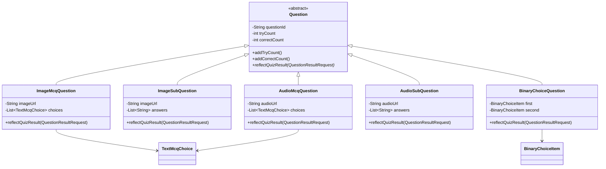

여러가지 유형의 퀴즈를 푸는 서비스를 개발하고 있습니다. 여러가지 유형의 데이터를 저장하고, 언제든지 새로운 유형의 퀴즈를 추가해야하는 요구사항이 있었기 때문에 NoSQL중 하나인 MongoDB에 데이터를 저장하고 있었습니다. 그 과정에서 다양한 유형의 문제를 다형성을 활용해서 표현하고 있었고, 여러 유형의 문제들이 `Question` 이라는 추상클래스를 상속받고 있었습니다. 하지만 두개 이상의 문제 유형이 추가되자 Spring Data MongoDB 에서 어떤 구현클래스로 매핑해야 하는지 판단하지 못하는 문제가 발생하였습니다.
# Spring Data MongoDB 추상클래스 매핑 에러
비즈니스 로직상 퀴즈의 유형은 이미지-주관식, 이미지-객관식, 오디오-주관식 등 여러가지가 있습니다. 퀴즈 도큐먼트 객체에 여러 유형의 문제를 매핑하기 위해서 문제를 표현하는 추상클래스를 두고 각 유형의 문제를 표현하는 구체클래스가 그를 상속하는 등 다형성을 최대한 활용하려고 노력했습니다.



그러다보니 자연스럽게 Quiz 도큐먼트는 다음과 같은 타입의 리스트를 가지게 되었습니다.
```java
@Document(collection = "quiz")  
@Getter  
@Builder  
@EntityListeners(AuditingEntityListener.class)  
public class Quiz {  
    //...
  
    private List<? extends Question> questions;  
  
    //...
}
```

문제의 실제 구현체는 전부 Question 추상클래스를 구현하고 있기 때문에 와일드 카드를 활용해서 Question 추상클래스의 서브클래스의 리스트가 올수 있는 리스트라고 표현된 것입니다.

그리고  Spring Data 의 인터페이스 레포지토리를 정의하고 실제로 Quiz 도큐먼트를 조회하려고 하자 `ClassNotFoundException`이 발생하였습니다.
> `org.springframework.beans.BeanInstantiationException`: Failed to instantiate [`com.poolygo.quiz.domain.Question`]: Class is abstract

questions 필드가 Question 이라는 추상클래스로 표현되어 있기 때문에 런타임에 어떤 클래스로 매핑해야하는지 Spring Data MongoDB가 알지 못하는 것이 원인이였습니다.
### @TypeAlias
처음 시도한 해결책으로는 @TypeAlias를 활용하는 것이였습니다. @TypeAlias는 Spring Data MongoDB에서 다형성 활용을 위해 제공하는 방법으로, 애노테이션 내부에 이름을 입력하면 그 이름이 실제 저장되는 도큐먼트의 `_class` 필드에 저장됩니다.

@TypeAlias를 적용하지 않으면 `_class`에는 패키지명이 포함된 클래스의 이름이 들어갑니다. 따라서 클래스의 위치가 변경되어도 기존의 데이터를 그대로 사용할 수 있다는 장점이 있습니다.

데이터를 불러올 때 `_class` 필드를 보고 어떤 타입으로 매핑해야하는지 알 수 있기 때문에 문제를 해결할 수 있을 것이라 생각했습니다. 그래서 `Question` 추상클래스의 서브클래스마다 `@TypeAlias` 애노테이션을 이용해서 고유의 이름을 지어주었습니다. 그리고 실제로 저장되는 도큐먼트에서도 별칭이 적용되는 것도 확인했습니다.

```java
@TypeAlias("audioMcqQuestion")  
public class AudioMcqQuestion extends Question {  
    //...
}

@TypeAlias("imageMcqQuestion")  
public class ImageMcqQuestion extends Question {  
    //...
}

@TypeAlias("imageSubQuestion")  
public class ImageSubQuestion extends Question {  
	//... 
}
```

실제 저장되는 데이터는 다음과 같습니다.
```json
{
  // ...
  "questions": [
    {
      "_class": "imageSubQuestion" // 타입표현
    },
  ],
  "_class": "com.poolygo.quiz.domain.Quiz"
}
```

하지만 별칭을 붙이는 방법을 활용한 후에도 문제는 해결되지 않았습니다. 새로운 설정을 적용하고, 서버를 실행하고, 데이터를 만들고, 조회할 때는 잘되었지만 서버를 재시작하니 동일한 문제가 발생했습니다.
### 커스텀 컨버터 작성
`@TypeAlias`를 적용한 후에도 문제는 해결되지 않았습니다. Spring Data MongoDB가 `Question` 이라는 추상클래스를 어떤 구체클래스로 매핑해야할지 여전히 찾지 못한 것입니다. 따라서 커스텀 컨버터를 작성해서 퀴즈의 타입에 따라 달라지는 매핑로직을 직접 작성하고 등록하기로 하였습니다.

MongoDB 도큐먼트를 매핑하는 커스텀 컨버터를 작성하는 방법은 [Spring Data MongoDB 공식문서](https://docs.spring.io/spring-data/mongodb/reference/mongodb/mapping/custom-conversions.html#page-title)에 자세히 설명되어 있습니다.

Spring Data MongoDB가 도큐먼트를 조회하면 그것은 `org.bson.Document` 타입으로 매핑됩니다. Document는 여러 타입의 데이터를 조회할 수 있는 메서드를 제공하고 파라미터에 키값을 전달해서 특정 타입으로 데이터를 매핑할 수 있습니다. 또 읽기용 컨버터, 쓰기용 컨버터라는 의미로 `@ReadConverter`, `@WriteConverter` 애노테이션을 활용할 수도 있습니다.

먼저 전체 코드를 살펴보겠습니다.
```java
@ReadingConverter  
public class QuizReadConverter implements Converter<Document, Quiz> {  
  
    @Override  
    public Quiz convert(Document source) {  
        // Quiz 공통 필드 매핑  
        String quizId = source.getObjectId("_id").toString(); // 퀴즈 ID        LocalDateTime createdAt = getLocalDateTimeFromDate(source, "createdAt"); // 생성 날짜  
        String title = source.getString("title"); // 제목  
        String description = source.getString("description"); // 설명  
        String quizType = source.getString("type"); // 퀴즈 타입  
        String thumbnailUrl = source.getString("thumbnailUrl"); // 썸네일 URL        int views = source.getInteger("views", 0); // 조회수  
        int tries = source.getInteger("tries", 0); // 시도 횟수  
        int likes = source.getInteger("likes", 0); // 좋아요 횟수  
        List<Integer> scoreDistribution = (List<Integer>) source.get("scoreDistribution"); // 점수 분포  
  
        // 사용자 정보  
        Document userInfoDoc = (Document) source.get("userInfo");  
        UserInfo userInfo = new UserInfo(userInfoDoc.getString("identifier"), userInfoDoc.getString("provider"));  
  
        List<Document> questionDocs = (List<Document>) source.get("questions"); // 질문 목록  
        List<Question> questions = new ArrayList<>();  
  
        if (questionDocs != null) {  
            for (Document doc : questionDocs) {  
                String typeAlias = doc.getString("_class");  
                Question question = convertQuestion(doc, typeAlias);  
                questions.add(question);  
            }  
        }  
  
        return Quiz.builder()  
            .id(quizId)  
            .createdAt(createdAt)  
            .userInfo(userInfo)  
            .title(title)  
            .description(description)  
            .thumbnailUrl(thumbnailUrl)  
            .type(QuizType.from(quizType))  
            .views(views)  
            .tries(tries)  
            .likes(likes)  
            .scoreDistribution(scoreDistribution)  
            .questions(questions)  
            .build();  
    }  
  
    private LocalDateTime getLocalDateTimeFromDate(Document source, String name) {  
        Date date = source.getDate(name);  
        return date.toInstant()  
            .atZone(ZoneId.systemDefault())  
            .toLocalDateTime();  
    }  
  
    private Question convertQuestion(Document doc, String typeAlias) {  
        switch (typeAlias) {  
            case "imageMcqQuestion":  
                return convertImageMcqQuestion(doc);  
            case "imageSubQuestion":  
                return convertImageSubQuestion(doc);  
            case "audioMcqQuestion":  
                return convertAudioMcqQuestion(doc);  
            case "audioSubQuestion":  
                return convertAudioSubQuestion(doc);  
            case "imageBinaryQuestion":  
                return convertBinaryChoiceQuestion(doc);  
            default:  
                throw new QuizException(ExceptionCode.QUIZ_DB_MAPPING_FAIL);  
        }  
    }
}
```
- `Converter`는 `org.springframework.core.convert.converter.Converter` 를 사용합니다. 다른것과 혼동해서는 안됩니다.
- `Converter<Document, Quiz>` 는 Document 타입을 받아 Quiz 타입으로 변환한다는 의미입니다.
- `get()`, `getObjectId()`, `getString()`, `getDate()` 등 여러 메서드를 활용해서 도큐먼트에 담긴 데이터를 가져옵니다.
- 문제 리스트를 순회하면서 `Question` 타입을 `convertQuestion` 메서드에 전달합니다.
	- 여기서 가지고 있는 typeAlias 값에 따라 처리할 메서드를 다르게 호출합니다.
	- `convertImageMcqQuestion` 메서드는 `ImageMcqQuestion` 을 반환
	- `convertAudioMcqQuestion` 메서드는 `AudioMcqQuestion` 를 반환

> MappingMongoConverter를 사용해서 편리하게 매핑할 수 있다는 글도 있었습니다. 하지만 
### 컨버터 등록
새롭게 만든 컨버터는 등록해야 사용할 수 있다.
```java
@Configuration  
@RequiredArgsConstructor  
public class MongoConfig extends AbstractMongoClientConfiguration {  
  
    @Override  
    public MongoClient mongoClient() {  
        return MongoClients.create("MongoDB Address");  
    }  
  
    @Override  
    protected String getDatabaseName() {  
        return "Database Name";  
    }  
  
    @Override  
    protected void configureConverters(  
        MongoCustomConversions.MongoConverterConfigurationAdapter adapter  
    ) {  
        super.configureConverters(adapter);  
        adapter.registerConverter(new QuizReadConverter());  
    }  
}
```
`AbstractMongoClientConfiguration` 클래스를 상속받고 
- `getDatabaseName`
- `configureConverters`

위 두개의 메서드를 오버라이드 해서 컨버터를 등록할 수 있다.
# 발생한 문제
## ConnetionException

```
com.mongodb.MongoSocketOpenException: Exception opening socket
	com.mongodb.internal.connection.DefaultServerMonitor$ServerMonitor.run(DefaultSer
	...
Caused by: java.net.ConnectException: Connection refused
    ...
```

공식문서에는 `getDatabaseName`과 `configureConverters` 메서드만 등장하는데, 실제로 저 두개만으로 컨버터를 등록하면, 로컬에서 MongoDB가 실행중이 아닐때 소켓 에러(`ConnectException`: Connection refused)가 발생합니다.

`AbstractMongoClientConfiguration`에서 `mongoClient()` 메서드를 오버라이드하지 않으면 기본적으로 로컬의 `localhost:27017`에 연결을 시도하게 되는데, 해당 주소에 MongoDB가 실행되고 있지 않으면 연결이 거부되기 때문입니다.

따라서, 원격 클러스터에 연결하고자 한다면 `mongoClient()` 메서드를 오버라이드하여 아래와 같이 실제 연결 문자열을 사용해야 합니다.

```java
@Override public MongoClient mongoClient() {     
	return MongoClients.create("MongoDB Address"); 
}
```

해당 설정을 적용하고 `ConnectionException`이 해결되었습니다.

# 참고
- [공식문서 - Custom Conversions :: Spring Data MongoDB](https://docs.spring.io/spring-data/mongodb/reference/mongodb/mapping/custom-conversions.html#page-title)
