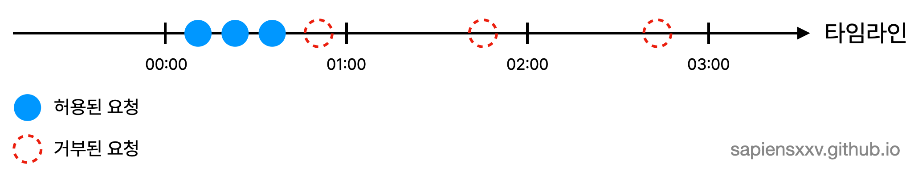
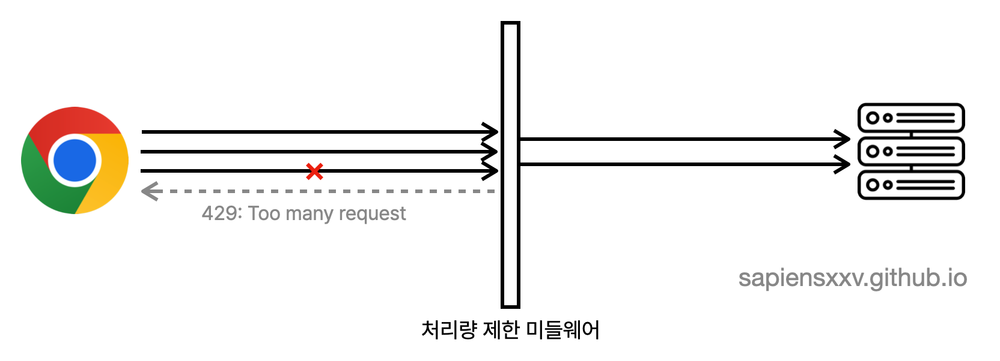
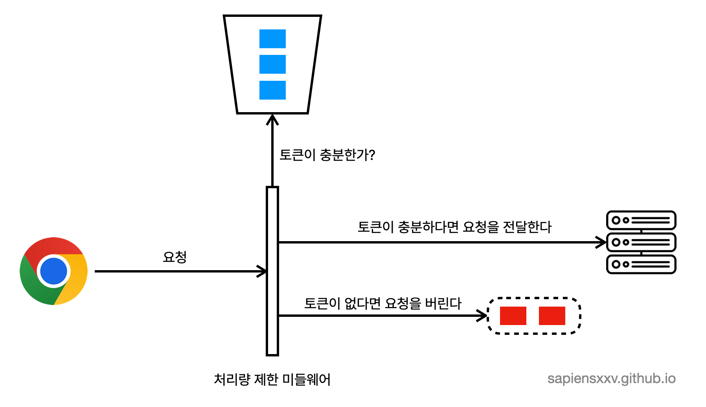
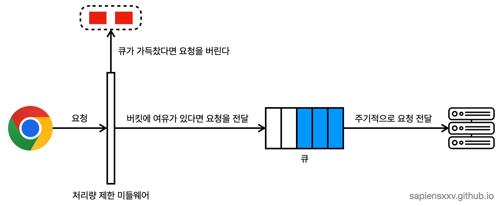
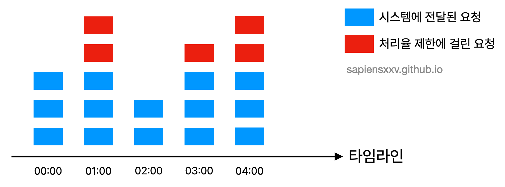
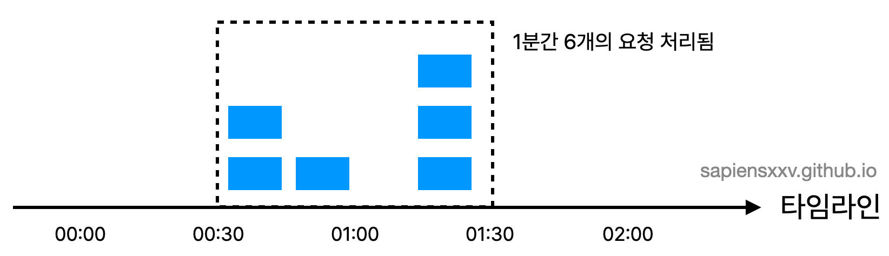
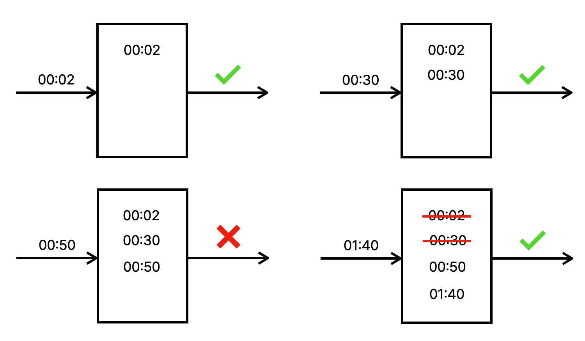
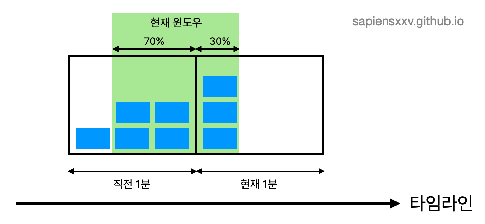

## 구현하게 된 이유
현재 운영하고 있는 사이트([메이플 주문서 시뮬레이터](gongnomok.com)) 에는 댓글 도배 방지 기능이 구현되어 있다. 동일한 사용자가 댓글을 도배하지 못하도록 어뷰징을 방지하기 위한 기능이다. WAS 내부에 인터셉터를 만들고 Redis를 활용해서 **댓글을 도배**하는 것 자체는 막을 수 있었지만 기능에는 큰 허점이 있었다.
### 기능 자체의 결함
기존의 기능은 다음과 같이 동작하고 있었다.
- 댓글 작성 요청이 오면 Redis에 사용자 정보를 키로 하고 작성 횟수를 값으로 하는 카운터를 저장한다.
- 요청이 올때마다 카운터 값을 증가시킨다. 이때 만료시간도 제한시간 만큼 갱신시킨다.

예를 들어, 1분당 댓글 작성 횟수를 3회로 제한하고 싶다고 하자.
처음으로 댓글을 작성하는 경우에는 카운터 값을 1로 만들고, 댓글 작성 요청이 올때마다 카운터 값을 증가시킨다. 그리고 만료시간도 현재 시간으로부터 1분 증가시킨다. 그리고 카운터의 값이 제한치인 3보다 커진다면 요청을 거부하는 방법으로 동작한다.

이 기능을 구현함으로써 한 사용자가 댓글을 도배하는 것 자체는 막을 수 있었다. 하지만 의도와는 다르게 동작하는 문제가 있었다. 유저당 1분간 댓글 작성 횟수를 3회로 제한하고 싶었지만 정상적으로 서비스를 사용한 사용자의 댓글 작성 요청조차 거부되는 현상이 있었습니다.



위 타임라인을 보면 `00:00` ~ `01:00` 사이에 사용자가 댓글작성 요청을 4회 보냈기 때문에 마지막 요청이 거부된 것을 볼 수 있습니다. 하지만 거부되는 시점에 Redis의 만료시간도 다시 1분으로 갱신되기 때문에 1분이 지나기 전에 전달된 요청도 거부되고, 또 만료시간이 갱신되고 1분이 지나기 전에 전달한 요청이 거부되는 것을 볼 수 있습니다. 결과적으로 3분 동안 보낸 6개의 요청 중에서 3개의 요청만 통과된 것입니다.
### WAS의 부담


또 다른 이유는 WAS에 부담이 되었기 때문이였습니다. 처리율을 제한하는 기능이 Spring Web의 인터셉터를 활용하고 있었기 때문에 거부되어야하는 요청이라도 결국에는 WAS에 도착해야 그 판단을 할 수 있었습니다. 나름 처리시간을 줄이고자 메모리 기반의 저장소인 Redis를 사용했지만 이것도 결국 네트워크 통신이 필요했기 때문에 다른 비즈니스 로직도 바쁘게 처리해야하는 WAS 에서는 부담스럽게 느껴졌습니다.



WAS에 전달되기 전에 처리량 제한기를 둔다면 꼭 필요한 요청만 WAS에 전달되어 부담이 덜해집니다.

### 처리량 제한기를 둬보자
처리량 제한기를 두면 기능의 결함도 해결하고, 요청이 WAS에 전달되기 전에 거부할 수 있기 때문에 WAS에 부담도 주지 않을 것이라고 생각했습니다. 또 이런 리버스 프록시 미들웨어를 직접 구현해본 적은 처음이기 때문에 좋은 경험이 될 것이라고 생각했다.

## 처리량 제한기를 직접 만든 이유
처리량 제한 기능을 사용하기 위해서 저처럼 꼭 직접 기능을 개발할 필요는 없습니다. 원래도 웹서버로 NGINX를 사용하고 있는데, NGINX에서도 처리량 제한 기능을 제공하기 때문에 그것을 활용해도 됩니다. 하지만 NGINX의 처리량 제한 기능은 기대하던 것과는 달랐다. 

뒤에서도 후술하겠지만 처리량을 제한하는데도 토큰 버킷, 누출 버킷, 슬라이딩 윈도우 카운터, 슬라이딩 윈도우 로깅, 고정 윈도 카운터 등등 여러가지 알고리즘이 존재한다. NGINX 가 제공하는 처리량 제한기능은 누출 버킷 알고리즘을 사용하고 있었고, 이것이 내가 원했던 방식과는 달랐다. NGINX 만으로는 Redis와 같은 외부 저장소와 연동하면서 알고리즘을 구현하기 까다로운 것도 이유 중 하나였다.

또 단일 고정 전략이 아니라 상황에 따라 알고리즘을 실험/적용해보고 싶었다. 사용자나 엔드포인트별로 서로 다른 쿼터나 가중치를 줄 수 있는 세밀한 제어가 가능한 제한기를 만들어보고 싶었다. 이러한 기술적인 욕심으로 저는 처리량 제한기 미들웨어를 직접 구현하였다.

## Golang을 선택한 이유
결론부터 말하면, 처리량 제한기를 Golang 으로 구현한 이유는 낮은 지연과 배포/운영의 단순함, 그리고 개발 생산성 사이의 균형이 가장 잘 맞는다고 판단했기 때문이다. Golang의 고루틴(goroutine)과 채널(channel) 이라는 동시성 모델이 수많은 동시 요청을 부담 없이 다루게 해주고, 특히나 누출 버킷 알고리즘을 구현할 때 많이 유용했다. 

또 다른언어와 비교했을 때 Java는 오버헤드나 메모리 부담이 크고, Rust는 성능이 뛰어나지만 복잡도와 생산성 측면에서 진입장벽이 있고, Python은 인터프리터라는 특성 때문에 처리량 제한기처럼 고성능/저지연 을 요구하는 곳에서는 불리하다고 판단했습니다.

## 알고리즘 설명
처음에는 내가 사용하고자 했던 이동 윈도우 로깅 알고리즘만 하드코딩으로 간단하게 구현하려고 했다. 하지만 개발하다보니 다른 알고리즘도 사용할 수 있도록 하고, 더 나아가서 서버 전체 처리량을 제한하거나 유저와 API별로 처리량을 설정할 수 있는 완성된 모듈을 만들어보고 싶어졌다. 결과적으로 알고리즘은 다음 다섯가지 알고리즘을 제공한다.
- 토큰 버킷 알고리즘 (Token Bucket)
- 누출 버킷 알고리즘 (Leaky Bucket)
- 고정 윈도우 카운터 알고리즘 (Fixed Window Counter)
- 이동 윈도우 로깅 알고리즘 (Sliding Window Log)
- 이동 윈도우 카운터 알고리즘 (Sliding Window Counter)

### 토큰 버킷 알고리즘
토큰 버킷 알고리즘은 위 다섯가지 알고리즘 중 가장 간단한 알고리즘이다. 
- 요청 단위마다 버킷을 두고 버킷마다 토큰을 채워넣는다. 
- 요청이 들어올때마다 토큰 하나를 소비한다.
- 토큰이 남아있다면 요청이 통과되고, 토큰이 남아있지 않다면 거부된다.
- 토큰은 주기적으로 채워진다.



토큰을 주기적으로 채워주는 기능을 구현하기 위해서 주기적으로 존재하는 모든 버킷을 순회하는 것이 아니라, 요청이 도착했을 때 해당 버킷을 마지막으로 사용한 이후로 충분한 시간이 지났다면 토큰을 채워주는 방법을 사용해서 오버헤드를 줄였다.

이 알고리즘을 사용할 때는 두가지 파라미터를 조절해야한다.
- 버킷 크기: 버킷에 담을 수 있는 토큰의 수
- 토큰 공급 주기: 초당(혹은 분당)몇개의 토큰을 버킷에 공급할 것인가
### 누출 버킷 알고리즘
누출 버킷 알고리즘은 시간단위로 요청 처리율이 고정되어 있는 알고리즘이다. 큐를 활용하는 알고리즘인데 실제로 구현할 때는 큐 자료구조를 사용한 것이 아니라 Golang의 채널(channel)을 활용했다. 채널에 데이터를 넣고 주기적으로 채널을 비워주면서 처리되도록 했다. 주기적으로 채널을 비우면서 요청을 처리하기 때문에 많은 요청에도 안정적인 요청을 원하는 경우 사용하면 좋은 알고리즘이다. (대학 수강신청을 생각해보자)
- 요청이 도착하면 채널이 가득 차있는지 확인한다. 
	- 채널에 빈자리가 있는 경우 채널에 요청을 추가한다.
	- 채널에 빈자리가 없는 경우 요청은 버려진다.
- 지정된 주기마다 큐에서 요청을 꺼내서 처리한다.



이 알고리즘의 경우 기본적인 기능은 구현했지만 채널에 빈자리가 없어 버려지는 요청이 처리되지 않고 버려지는 것에 대한 보완이 필요하다. 메세지 큐에 도착한 요청을 넣어두고 주기적으로 꺼내서 채널에 요청을 담는 방법으로 문제를 해결할 수 있을 것 같다.
### 고정 윈도우 카운터 알고리즘
타임라인을 윈도우라는 고정된 단위로 나누고 각 윈도우마다 카운터를 붙이는 방법이다.
- 요청이 들어올때마다 윈도우의 카운터 값이 1 증가한다.
- 윈도우의 카운터 값이 임계치와 같거나 큰 경우 들어오는 요청은 버려진다.
- 윈도우의 카운터 값이 임계치보다 작은 경우 요청이 받아들여진다.

1분간 3번의 요청으로 제한된 경우를 그림으로 나타내면 아래와 같다.



하지만 이 알고리즘은 경계 부분에 트래픽이 집중 될 경우 기대했던 시스템의 처리 한도보다 더 많은 양의 요청을 처리하게 된다는 단점이 있다.



`01:00` 주변의 경계 부분에 트래픽이 집중되어 `00:30` ~ `01:30` 사이에는 1분간 6개의 요청이 처리된 것을 볼 수 있다.
### 이동 윈도우 로깅 알고리즘
이동 윈도우 로깅 알고리즘을 사용하면 트래픽이 경계부근에 몰리는 경우 기대보다 많은 요청을 처리하게 되는 문제를 해결할 수 있다. 

- 로그가 비어있다면 요청을 허용하고 타임스탬프를 기록한다.
- 로그가 비어있지 않다면 
	- 윈도우 범위 밖에 있는 타임스탬프가 있는지 확인하고 삭제한다.
	- 윈도우 내 타임스탬프의 갯수가 임계치보다 작다면 요청을 허용한다.
	- 윈도우 내 타임스탬프의 갯수가 임계치와 같거나 크다면 요청을 거부한다.

아래 그림은 분당 2개 요청이 한도인 시스템을 나타낸 것이다.
`00:50`에 도착한 요청의 경우 `[00:00, 00:50)` 윈도우에 이미 로그가 2개 들어가 있었기 때문에 요청이 차단된 것을 확인할 수 있다. `01:40`에 도착한 요청의 경우에는 `[00:40, 01:40)` 범위 안의 요청만이 1분 윈도우 안의 요청이기 때문에 `00:40` 이전의 요청들은 모두 삭제되고, `01:40`에 도착한 요청이 들어왔을 때 윈도우의 사이즈가 2 이기 때문에 허용되는 것을 볼 수 있다.



실제 구현에서는 Redis를 활용해서 버킷마다 Sorted Set을 두고 타임스탬프를 저장했다. Sorted Set을 활용해서 가장 오래된 타임스탬프가 무엇인지 확인하거나, 이미 윈도우 범위를 벗어난 타임스탬프를 쉽게 파악할 수 있었다.
### 이동 윈도우 카운터 알고리즘
이동 윈도우 카운터 알고리즘은 고정 윈도우 알고리즘과 이동 윈도우 로깅 알고리즘을 결합한 형태이다. 현재 윈도우가 직전 고정 시간대와 현재 고정 시간대를 얼마나 차지하고 있는지, 그 가중치에 따라서 현재 윈도우의 요청 수를 근사치로 계산하는 방법이다.



현재 윈도우에 몇개의 요청이 있는지는 다음과 같이 계산할 수 있다.
현재 1분간 요청 수 + 직전 1분간 요청 수 * 이동 윈도우와 직전 1분이 겹치는 비율
공식에 따라 그림에 나타나 있는 현재 윈도우에 들어가 있는 요청은 $3 + 4 \times \frac{70}{100} = 5.8$ 개 이다. 내림할지, 올림할지 반올림할지는 본인이 결정하면 된다.

나는 댓글 작성 요청 제한기능을 구현하면서 이 이동 윈도우 카운터 알고리즘을 사용했다. 메모리 효율도 좋고 이전 시간대의 처리율에 따라 현재 윈도우의 상태를 계산하기 때문에 짧은 시간에 몰리는 트래픽에도 잘 대응되기 때문이다.
## 기능설명
앞서 설명한 여러 알고리즘을 바탕으로 요청 처리율을 제한하는 기능을 제공합니다. 
### yml 파일을 통한 설정
전체 서버 기준의 일괄 제한 뿐만 아니라 사용자, API(엔드포인트), IP 등 식별자별로 각각 다른 쿼터를 부여할 수 있어서 상황에 따라 세밀하게 정책을 달리 적용할 수 있습니다.

정책과 파라미터가 코드에 하드코딩되어 있지 않고 외부의 yml 설정 파일에서 읽어오기 때문에 운영중에도 동작방식을 관리하고 실험하기 용이하도록 만들었습니다. 윈도우 크기, 버킷의 크기, 알고리즘 종류, 식별자 키, 등 다양한 값을 설정파일로 정의할 수 있어 정책 변경이나 트래픽 특성에 따른 튜닝을 간편하게 할 수 있습니다.

```yml
rateLimiter:  
  strategy: sliding_window_counter  
  # token bucket, leaky bucket, fixed window counter, sliding window counter, sliding_window_log  
  identity:  
    key: ipv4  
    header: X-Forwarded-For  
  client: # 클라이언트의 전체 처리량 제한  
    limit: 50  
    windowSeconds: 60  
  apis: # 특정 API 처리량 제한  
    - identifier: comment_write  
      path:  
        expression: regex  
        value: ^/api/item/\d+/comment$  
      method: POST  
      limit: 5  
      windowSeconds: 60  
      refillSeconds: 60 #// 토큰 버킷 알고리즘의 경우 토큰 리필 시간  
      expireSeconds: 3600  
  target: https://gongnomok.com # 통과된 요청이 전달될 도메인
```
- **rateLimiter**: 설정의 루트. 처리율 제한의 모든 설정정보는 이곳에서 시작한다.
	- **strategy**: 처리량 제한에서 사용할 알고리즘을 선택하는 옵션입니다.
		- `token_bucket`: 토큰 버킷 알고리즘
		- `leaky_bucket`: 누출 버킷 알고리즘
		- `fixed_window_counter`: 고정 윈도우 카운터
		- `sliding_window_log`: 이동 윈도우 로그
		- `sliding_window_counter`: 이동 윈도우 카운터
	- **identity**: 사용자를 어떻게 시별할지 결정하는 옵션입니다.
		- **key**: 사용자를 식별하는 기준 
			- `ipv4`: IPv4 주소를 기준으로 사용자를 식별합니다.
		- **header**: 사용자 식별 정보를 얻어올 수 있는 헤더 이름
	- **apis**: 특정 API의 처리량을 제한하는 옵션입니다. 리스트로 여러가지 API를 명시할 수 있습니다.
		- **key**: api 식별자. 어떠한 문자열이라도 괜찮습니다. 단, 다른 API에 대해 유일해야합니다.
		- **path**: API 경로를 표현하는 옵션입니다.
			- **expression**: API 표현 방식. 이 값에 따라 value 옵션의 해석 방법이 결정됩니다.
				- `regex`: 정규식 표현
				- `plain`: 일반 텍스트 표현
			- **value**: API 경로 표현. expression이 regex 였다면 정규식을, plain이였다면 경로 문자열을 그대로 작성하면 됩니다.
		- **method**: HTTP 메서드
		- **limit**: 요청 임계치. 윈도우나 버킷의 최대 사이즈가 이 옵션에서 결정됩니다.
		- **windowSeconds**: 윈도우 시간 단위. 윈도우 관련 알고리즘을 사용하는 경우 설정해야 합니다.
			- 고정 윈도우 카운터 알고리즘
			- 이동 윈도우 로깅 알고리즘
			- 이동 윈도우 카운터 알고리즘
		- **refillSeconds**: 버킷에 토큰이 채워지는 시간단위. 버킷 관련 알고리즘을 사용하는 경우 설정해야 합니다.
			- 토큰 버킷 알고리즘
			- 누출 버킷 알고리즘
		- **expireSeconds**: 사용되지 않는 버킷이나 윈도우가 메모리/Redis에서 유지되는 시간
	- **target**: 허용된 요청이 전달될 도메인 주소
### 클라이언트 측에서 받을 수 있는 정보
트래픽이 거부되어 시스템으로 전달되지 않는다면 처리율 제한기에서는 HTTP 헤더를 사용해 처리율 제한과 관련된 정보를 전달합니다.
- `X-RateLimit-Remaining`: 윈도우 내에 남은 처리 가능 요청의 수
- `X-RateLimit-Reset`: 매 윈도마다 클라이언트가 전송할 수 있는 요청의 수
- `X-RateLimit-Retry-After`: 한도 제한에 걸리지 않으려면 몇초 뒤에 요청을 다시 보내야하는지 알림
## 개선점
### 기본 값이나 필수 여부
예를 들어 설정 파일에서 strategy 항목이 빠졌을 때 기본값은 무엇인지, 어떤 것을 필수 항목으로 할것인지, 필수 항목이 누락되었을 때 어떻게 동작해야 하는지 명기해야 한다.
### 유효한 값을 검증
설정파일에 작성된 내용들이 올바른 것인지 검사하는 과정이 필요함. 예를 들어 경로 표현에서 expression이 정규표현식(regex)일 때 정규식이 잘못되면 처리량 제한에 실패하기 때문에 파싱검증이 필요하다. 그리고 limit와 같은 설정값에는 꼭 정수가 오도록 검사가 필요하다.
### 경로 매칭 예시 보여주기
README 에서라도 경로매칭 예시를 보여주면 사용하는 입장에서 편리할 것이다.
- expression: `plain` & value: `/api/comment`
- expression: `regex` & value: `^/api/item/\d+/comment$`
등과 같은 표현의 예시를 짧게 보여주면 편리할 것.
